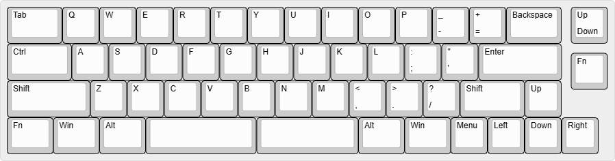
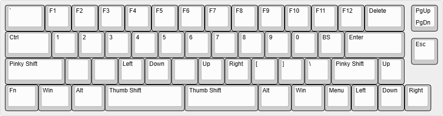
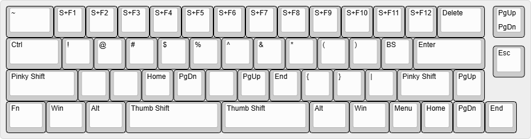
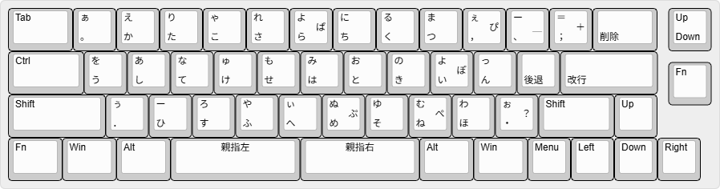
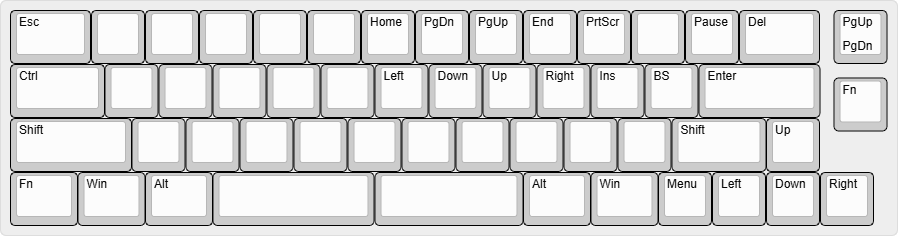

# 4段50%キーボード 親指シフトキーマップ

英数レイヤーに、NICOLA親指シフトのような同時打鍵動作を取り入れたキーマップです。  

## 配列

### 英数 - 基本配置

* 基本的なQWERTY配列。数字行なし
* Pの右に "-" "=" "Backspace" を配置 (少し近くなった)
* "[" "]" "\\" は別レイヤー

### 英数 - 親指同側シフト配置

* 同側シフトでFキーと数字キーを入力する
* 1行目 (QWERTYの行) → F1 ～ F12 を入力
* 2行目 (ASDFGHの行) → 1 ～ 0 を入力
* "[" "]" "\\" は右下に配置 (キーの性格が似ているため)

### 英数 - 親指クロスシフト配置

* クロスシフトで Shift+Fキー、Shift+数字キー を入力する。

### かな - NICOLA配置

* 左親指 → 右親指 の同時打鍵で親指シフトON
* 右親指 → 左親指 の同時打鍵で親指シフトOFF
* 小指シフトを使って英数入力する場合に、親指シフト同時打鍵を使った数字・記号・Fキー入力が可能 例えば 小指Shift を押しながら *"右親指 + U" を同時打鍵* → F7 キーを入力、すなわちカタカナ変換となる。 

### Fnキー

* Esc とカーソル移動
* Esc を移動すれば不要

## 情報元
* https://github.com/eswai/qmk_firmware/ を元にNICOLA規格のタイミング判定を追加しました。

