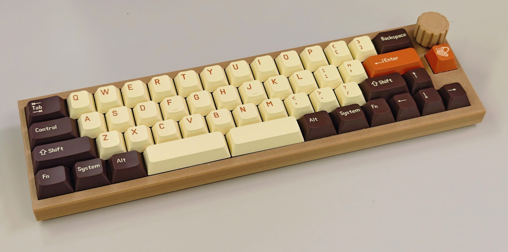

# 4段50%キーボード 親指シフトキーマップ

### 習得簡単・コンパクト

英数レイヤーに、NICOLA親指シフトのような同時打鍵動作を取り入れたキーマップです。  

# 配列

### 英→単独打鍵 ・ 数→同時打鍵

## 英数 - 単独

* QWERTY配列
* "-" "=" "Backspace" → 右上 (一行近い)
* "[" "]" "\\" → 親指シフト

## 英数 - 同側シフト

* F1 ～ F12 → 1行目 (QWERTYの行)
* 1 ～ 0 → 2行目 (ASDFGHの行)
* "[" "]" "\\" → 右下

## 英数 - クロスシフト

* Shift+F1 ～ F12
* Shift+1 ～ 0

## かな - NICOLA配置

* かなオン → 左親指 右親指 同時打鍵
* かなオフ → 右親指 左親指 同時打鍵
* 小指シフト押しながら、英数入力ができる
* 小指シフト押しながら、親指シフト同時打鍵で数字・記号・Fキー入力が可能 例) 小指シフト を押しながら *"右親指 + U" を同時打鍵* → F7 キー (カタカナ変換)

# 情報元
* https://github.com/eswai/qmk_firmware/ を元にNICOLA規格のタイミング判定を追加しました。

