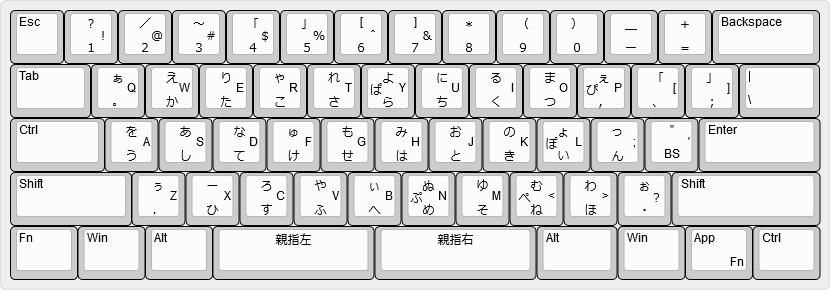

# XD64 VER3.0 分割スペースバー 用 親指シフトキーマップ (NICOLA配列)

キーボード側で親指シフト出力するためのキーマップです。  
物理的なキー配置はANSI配列ですが、JISキーボードのキーコードを送信します。

## 配列

## 物理配列 = ANSI配列 を JIS配列に置き換える

|ANSI物理キー|NoShift出力|VK (JIS)|Shift出力|VK (JIS)|
|---|---|---|---|---|
|JU_2|2|KC_2|@|*KC_LBRC*|
|JU_6|6|KC_6|^|*KC_EQL*|
|JU_7|7|KC_7|&|Shift + KC_6|
|JU_8|8|KC_8|*|Shift + KC_QUOT|
|JU_9|9|KC_9|(|Shift + KC_8|
|JU_0|0|KC_0|)|Shift + KC_9|
|JU_MINS|-|KC_MINS|_|Shift + KC_INT1|
|JU_EQL|=|*Shift +* KC_MINS|+|Shift + KC_SCLN|
|JU_BSLS|\\|KC_INT1|\||Shift + KC_INT3|
|JU_SCLN|;|KC_SCLN|:|*KC_QUOT*|
|JU_QUOT|'|*Shift +* KC_7|"| Shift + KC_2|
|JU_GRV|\`|*Shift +* KC_LBRC|~|Shift + KC_EQL|
斜体表記はシフト状態の変化

|JIS論理キー|VK Code|NoShift入力|Shift入力|
|---|---|---|---|
| 2, " |KC_2|JU_2|Shift + JU_QUOT|
| 6, & |KC_6|JU_6|Shift + JU_7|
| 7, ' |KC_7|JU_7|*JU_QUOT*|
| 8, ( |KC_8|JU_8|Shift + JU_9|
| 9, ) |KC_9|JU_9|Shift + JU_0|
| 0  |KC_0|JU_0|(N/A)|
| -, = |KC_MINS|JU_MINS|Shift + JU_EQL|
| ^, ~ |KC_EQL|*Shift +* JU_6|Shift + JU_GRV|
| \\, \| |KC_INT3|(N/A)|Shift + JU_BSLS|
| @, \` |KC_LBRC|*Shift +* JU_2|*JU_GRV*|
| ;, + |KC_SCLN|JU_SCLN|Shift + JU_EQL|
| :, * |KC_QUOT|*Shift +* JU_SCLN|Shift + JU_8|
| \\, _ |KC_INT1|JU_BSLS|Shift + JU_MINS|

## 情報元

* https://github.com/eswai/qmk_firmware/ を元にNICOLA規格のタイミング判定を追加しました。
* [jtu_custom_keycodes](https://github.com/koktoh/jtu_custom_keycodes/tree/master/default) を元にRepeat判定を追加しました。
