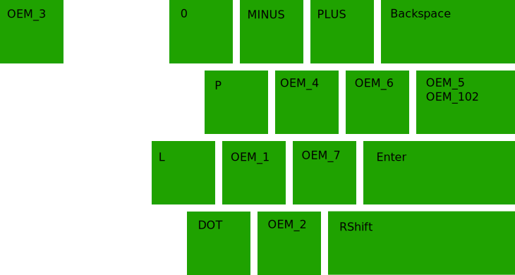
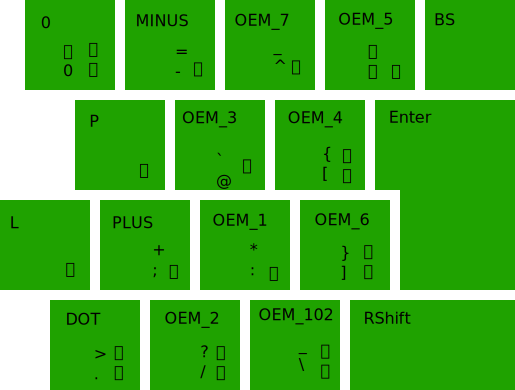
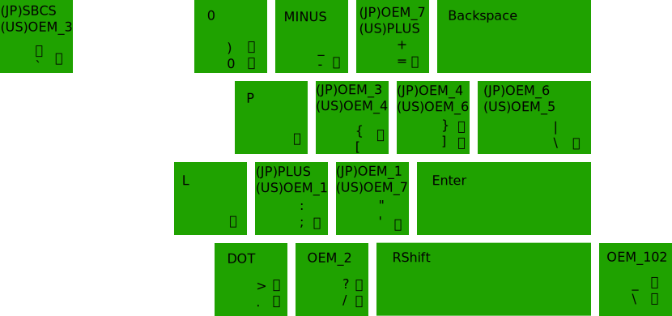

# XD64 VER3.0 ANSI split spacebar 用 親指シフトキーマップ (NICOLA配列)

キーボード側で親指シフト出力するためのキーマップです。  
一部の記号を入力するためJISキーボードとしてふるまいます。  
kbd106_ansi.dllを使用します。  

## 配列
### 英数
 1  2  3  4  5    6  7  8  9  0  -  =  BS  
&nbsp;  q  w  e  r  t    y  u  i  o  p  [  ]  \  
&nbsp;&nbsp;   a  s  d  f  g    h  j  k  l  ;  ' ENTER  
&nbsp;&nbsp;&nbsp;    z  x  c  v  b    n  m  ,  .  /  
### そのまま押した場合
 １ ２ ３ ４ ５   ６ ７ ８ ９ ０ ー ＝ BS  
&nbsp;  。 か た こ さ   ら ち く つ ， 、 ； ￥  
&nbsp;&nbsp;   う し て け せ   は と き い ん BS ENTER  
&nbsp;&nbsp;&nbsp;    ． ひ す ふ へ   め そ ね ほ ・  
## 親指シフト時  ※ 8 9 0 は ANSI配列の括弧に合わせている
 ？ ／ ～ 「 」   ［ ］ ＊ （ ） ＿ ＋  
&nbsp;  ぁ え り ゃ れ   よ に る ま ぇ 「 」 ￥  
&nbsp;&nbsp;   を あ な ゅ も   み お の ょ っ ’  
&nbsp;&nbsp;&nbsp;    ぅ ー ろ や ぃ   ぬ ゆ む わ ぉ  
## クロスシフト時
 ？ ／ ～ 「 」   ［ ］ ＊ （ ） ＿ ＋   
&nbsp;   が だ ご ざ   ぱ ぢ ぐ づ ぴ   「 」 ￥  
&nbsp;&nbsp;   ヴ じ で げ ぜ   ば ど ぎ ぽ .. BS  
&nbsp;&nbsp;&nbsp;    .. び ず ぶ べ   ぷ ぞ ぺ ぼ ゛  
## 小指シフト
 ！ ＠ ＃ ＄ ％   ＾ ＆ ＊ （ ） ＿ ＋   
&nbsp;  Ｑ Ｗ Ｅ Ｒ Ｔ   Ｙ Ｕ Ｉ Ｏ Ｐ ｛ ｝ ｜  
&nbsp;&nbsp;   Ａ Ｓ Ｄ Ｆ Ｇ   Ｈ Ｊ Ｋ Ｌ ： BS  
&nbsp;&nbsp;&nbsp;    Ｚ Ｘ Ｃ Ｖ Ｂ   Ｎ Ｍ ＜ ＞ ？  

## ライブラリ

https://github.com/sadaoikebe/Windows-driver-samples/tree/master/input/layout/fe_kbds/jpn/ansi106

kbd106_ansi.dll を C:\Windows\System32 にコピー
kbd106_ansi.reg を import

## スキャンコードとVKコードの対応

ANSI Layout

JIS Layout

JIS Layout SW layer on ANSI Layout HW

| VK | ANSI | JIS |
|----|----|----|
| OEM_MINUS | -, _ | -, = |
| OEM_PLUS | =, + | ;, + |
| OEM_4 | ［, ｛ | ［, ｛ |
| OEM_6 | ］, ｝ | ］, ｝ |
| OEM_5 | \\, \| | \\, \| |
| OEM_102 | \\, \| | \\, _ |
| OEM_1 | ;, : | :, * |
| OEM_7 | ', " | ^, ~ |
| OEM_2 | /, ? | /, ? |
| OEM_3 | \`, ~ | \`, @ |

|KEY|CODE|
|----|----|
|無変換 |KC_MHEN KC_INT5 |
|変換 |KC_HENK KC_INT4 |
|カタカナ ひらがな ローマ字 |KC_KANA KC_INT2|
|半角 全角 漢字 |KC_ZKHK KC_GRAVE|

## 情報元

https://github.com/eswai/qmk_firmware/ を元にXD64に移植しました。
https://bsakatu.net/doc/how-to-input-japanese-more-convinient-with-us-layout/ こちらの知見をもとに kbd106_ansi.dll を作成、ただし英数キーとかな「む」キーなど一部必要性に応じて変更。
