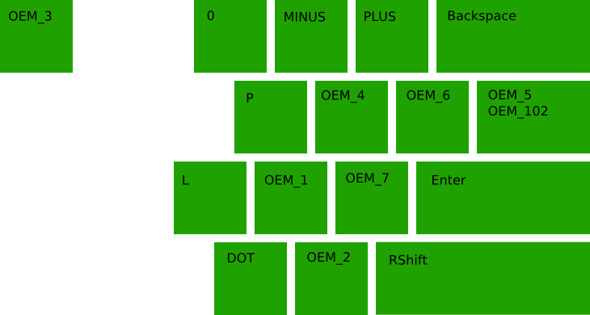
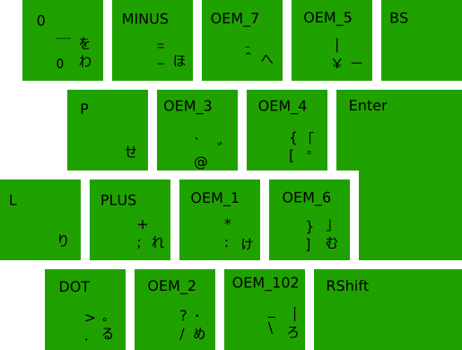
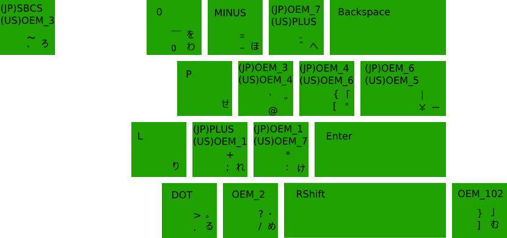

# XD64 VER3.0 ANSI split spacebar 用 親指シフトキーマップ (NICOLA配列)

ソフトウェアをインストールせずにキーボードのみで親指シフトするためのキーマップです。
一部の記号を入力するためキーボードライブラリを変更します。

### ライブラリ

https://github.com/sadaoikebe/Windows-driver-samples/tree/master/input/layout/fe_kbds/jpn/ansi106

kbd106_ansi.dll を C:\Windows\System32 にコピー
kbd106_ansi.reg を import

### キーマップ

スキャンコードとVKコードの対応は以下の通り  

ANSI Layout

JIS Layout

JIS Layout SW layer on ANSI Layout HW

| VK | ANSI | JIS |
| OEM_MINUS | -, _ | -, = |
| OEM_PLUS | =, + | ;, + |
| OEM_4 | ［, ｛ | ［, ｛ |
| OEM_6 | ］, ｝ | ］, ｝ |
| OEM_5 | backslash, pipe | yen, pipe |
| OEM_102 | backslash, pipe | backslash, _ |
| OEM_1 | ;, : | :, * |
| OEM_7 | ', " | ^, ~ |
| OEM_2 | /, ? | /, ? |

|無変換 |KC_MHEN KC_INT5 |
|変換 |KC_HENK KC_INT4 |
|カタカナ ひらがな ローマ字 |KC_KANA KC_INT2|
|半角 全角 漢字 |KC_ZKHK KC_GRAVE|

https://github.com/eswai/qmk_firmware/ を元にXD64に移植しました。
